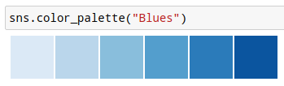
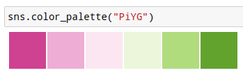

class: dark-background

# Data visualization

## Figure design, design process, and fundamentals

### Radovan Bast
### UiT The Arctic University of Norway

---

Data visualization is a

## "Visual representation and presentation of data to facilitate understanding"

.cite[["Fundamentals of Data Visualization", C. O. Wilke](https://clauswilke.com/dataviz/)]

### Data visualizations map .emph[data values] onto .emph[aesthetics/channels]

- position
- length
- shape
- size
- color
- line width
- line type

---

## How I design plots

- Sketch with pen and paper
- Browse directories/galleries for inspiration:
  [Matplotlib](https://matplotlib.org/gallery.html),
  [Seaborn](https://seaborn.pydata.org/examples/index.html),
  [Altair](https://altair-viz.github.io/gallery/index.html),
  [Plotly](https://plotly.com/python/),
  [Bokeh](https://demo.bokeh.org/),
  [ggplot](https://yhat.github.io/ggpy/),
  [PyNGL](https://www.pyngl.ucar.edu/Examples/gallery.shtml),
  [K3D](https://k3d-jupyter.org/showcase/),
  [ggplot2](https://ggplot2.tidyverse.org/),
  [Shiny](https://shiny.rstudio.com/),
  [Data-Driven Documents](https://d3js.org/), ...
- Take an example that is close to what I want
- Try to feed in my own data
- Refine

---

.left-column50[

]

.right-column50[

]

---

## Design principles

### Good data visualization is ...

- .emph[trustworthy/reliable]
- .emph[accessible/usable]
- .emph[elegant/aesthetic]

.cite[["Data Visualisation: A Handbook for Data Driven Design", A. Kirk](https://www.visualisingdata.com/book/)]

### Examples

- Reliable: Proportional ink
- Usable: Avoid 3D plots (unless it's 3D object)
- Elegant: maximize the data/ink ratio, within reason

---

## Reliable: The principle of "proportional ink"

Examples with disproportional data/ink ratio:

.cite[Both figures from https://www.callingbullshit.org/tools/tools_proportional_ink.html]

---

## Usable: Avoid 3D plots (unless it's 3D object)

... unless you are plotting something inherently 3D (molecular structures,
structure of an enzyme, a 3D relief of a terrain)

.cite[https://matplotlib.org/3.1.1/gallery/mplot3d/scatter3d.html]

---

## Coordinates: linear vs. log

### There are also polar coordinates and spherical coordinates and their projections (more about that later)

.left-column50[

- Linear axes are linear in addition
]

.right-column50[

- Log scales are linear in multiplication
- Log scales used when the dataset contains numbers of very different magnitudes
]

---

## Colors

### Great resources

- https://clauswilke.com/dataviz/color-pitfalls.html
- https://blog.datawrapper.de/beautifulcolors/
- [Okabe, M., and K. Ito. 2008. "Color Universal Design (CUD): How to Make Figures and Presentations That Are Friendly to Colorblind People."](https://jfly.uni-koeln.de/color/)
- https://seaborn.pydata.org/tutorial/color_palettes.html
- https://colorbrewer2.org/

---

## Colors

### Fundamental use cases

- Distinguish groups of data
- Represent data values
- Highlight

.cite[["Fundamentals of Data Visualization", C. O. Wilke](https://clauswilke.com/dataviz/)]

### This is how most of us start but this is problematic:

.quote["We need five colors for the plot: black ... red ... green ... blue ... ... ... orange?"]

---

## Colors

### Consider color vision deficiencies (CVD)

.left-column50[

]

.right-column50[
- 4% of the population is affected
- View your color figures under CVD simulations
- Use color scales designed to be CVD-friendly
]

---

## Color scales: 3 types

- .emph[Discrete/qualitative] color scales: designed to distinguish

.cite[[Okabe, M., and K. Ito. 2008. "Color Universal Design (CUD): How to Make Figures and Presentations That Are Friendly to Colorblind People."](https://jfly.uni-koeln.de/color/)]

- .emph[Sequential/continuous] color scales: represent data values

- .emph[Diverging] color scales: visualize deviation of data values relative to a neutral midpoint
.cite[ColorBrewer pink to yellow-green]

---

## Discrete/qualitative color scales: designed to distinguish

.left-column50[

- Great for scatter-plots.

- What if you need more than 8 colors? Use direct labeling instead.

.cite[[Okabe, M., and K. Ito. 2008](https://jfly.uni-koeln.de/color/)]
]

.right-column50[

.cite[<https://seaborn.pydata.org/examples/multiple_regression.html>]
]

---

## Sequential/continuous color scales: represent data values

.left-column50[

- Great for choropleth plots (here plotting unemployment rate).

- Color vision deficiencies less of a concern for this type.
]

.right-column50[

.cite[<https://altair-viz.github.io/gallery/choropleth.html>]
]

---

## Diverging color scales: visualize deviation of data values relative to a neutral midpoint

.left-column50[

- Great for heatmaps.

.cite[ColorBrewer pink to yellow-green]
]

.right-column50[

.cite[<https://seaborn.pydata.org/examples/many_pairwise_correlations.html>]
]

---

class: light-background, center, middle

 
 
 
 
 
 
# Data visualization

### Radovan Bast, UiT The Arctic University of Norway
