class: dark-background

# Data visualization

## Gallery of visualizations

### Radovan Bast
### UiT The Arctic University of Norway

---

## Gallery of visualizations

We will show .emph[typical examples] and discuss .emph[main pitfalls] for each:

- x-y relationships
- Amounts
- Distributions
- Proportions
- Geospatial data
- Trends and uncertainty

.cite[Categorization somehow following https://clauswilke.com/dataviz/directory-of-visualizations.html]

### The goal of doing this

- So that we know what to search for
- Source of inspiration

---

## Where to find good overviews

These can offer other categorizations:

- https://clauswilke.com/dataviz/directory-of-visualizations.html
- https://datavizcatalogue.com/search.html
- https://depictdatastudio.com/charts/
- https://github.com/ft-interactive/chart-doctor/tree/main/visual-vocabulary
- https://extremepresentation.typepad.com/.shared/image.html?/photos/uncategorized/choosing_a_good_chart.jpg

---

## x-y relationships (1/3)

.left-column50[
### Line graph

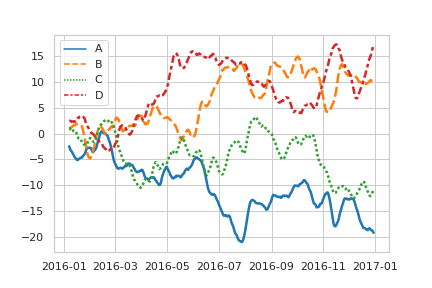
.cite[https://seaborn.pydata.org/examples/wide_data_lineplot.html]
]

.right-column50[
### Scatterplot

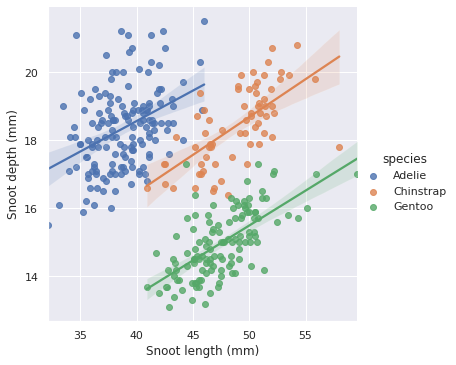

- Smooth lines can be used to represent trends

.cite[https://seaborn.pydata.org/examples/multiple_regression.html]
]

---

## x-y relationships (2/3)

.left-column50[
### Bubble plot

.cite[https://seaborn.pydata.org/examples/scatter_bubbles.html]
]

.right-column50[
### Pitfalls

- Overplotting -> bins or contours
- Too many colors -> different plot type or labels
]

---

## x-y relationships (3/3)

.left-column50[
### Bins

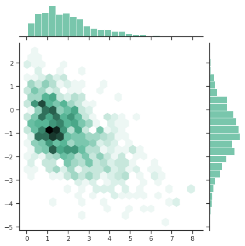
.cite[https://seaborn.pydata.org/examples/hexbin_marginals.html]
]

.right-column50[
### Contours

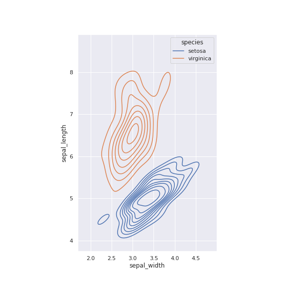
.cite[https://seaborn.pydata.org/examples/multiple_bivariate_kde.html]
]

---

## Amounts (1/3)

.left-column50[
### Bars

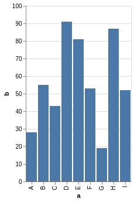

- Mind the principle of .emph[proportional ink]
- Bars need to start at zero
- Instead of bars one can use dots

.cite[https://altair-viz.github.io/gallery/simple_bar_chart.html]
]

.right-column50[
### Grouped bars

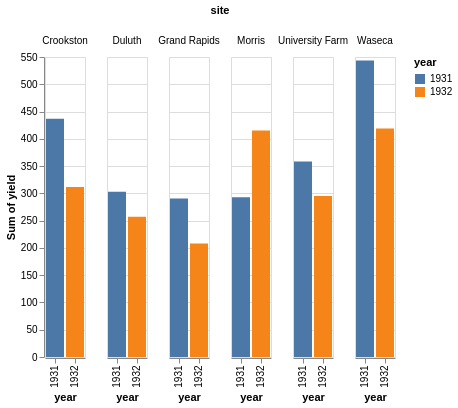

- Bars can be horizontal or vertical
- We can split them by facetting

.cite[https://altair-viz.github.io/gallery/grouped_bar_chart.html]
]

---

## Amounts (2/3)

.left-column60[
### Stacked bars

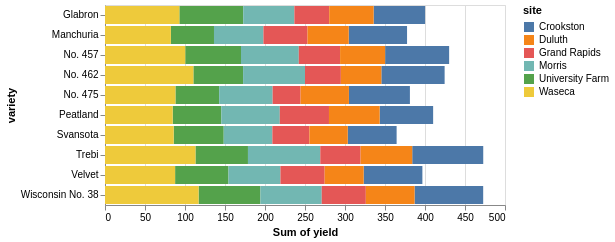

.cite[https://altair-viz.github.io/gallery/horizontal_stacked_bar_chart.html]
]

.right-column40[

- Horizontal works well for longer labels
- Arrange bars in a logical/intuitive order
- Stacking is useful if the sum of amounts represents a meaningful amount
- Only the yellow portion is easy to compare
- Works very well if there are only two bars in each stack
]

---

## Amounts (3/3)

### Heatmap

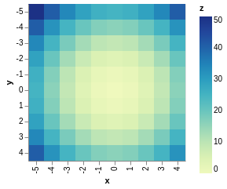

.cite[https://altair-viz.github.io/gallery/simple_heatmap.html]

---

## Distributions (1/4)

.left-column50[
### (Faceted) histogram

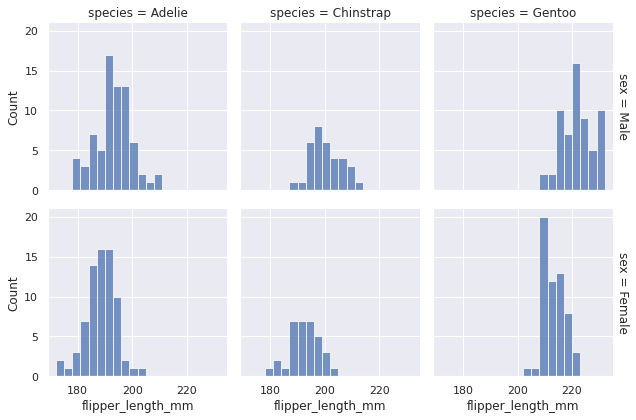

- Always explore multiple bin widths

.cite[https://seaborn.pydata.org/examples/faceted_histogram.html]
]

.right-column50[
### Layered histogram

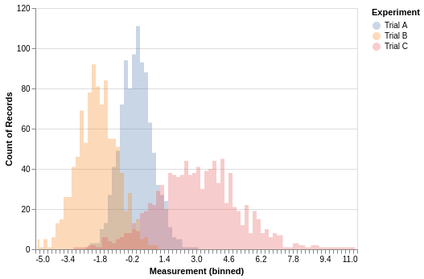

.cite[https://altair-viz.github.io/gallery/layered_histogram.html]
]

---

## Distributions (2/4)

.left-column50[
### Stacked histogram

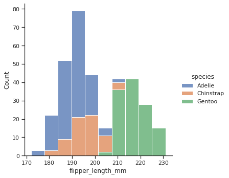

- Difficult to interpret
- Both histograms and density plots require arbitrary parameters choices
]

.right-column50[
### Density plot

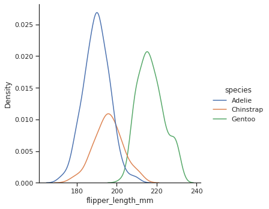

- Works better than histograms to visualize several distributions at once
- Check scaling and boundary conditions for density estimates
]

---

## Distributions (3/4)

### Ridgeline plot

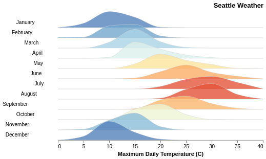

.cite[https://altair-viz.github.io/gallery/ridgeline_plot.html]

---

## Distributions (4/4)

### Strip-plot vs box-plot vs violin-plot

.cite[[J. Matejka, G. Fitzmaurice, "Same Stats, Different Graphs: Generating Datasets with Varied Appearance and Identical Statistics through Simulated Annealing"](https://www.autodeskresearch.com/publications/samestats)]

---

## Proportions (1/2)

.left-column50[
### Pie chart

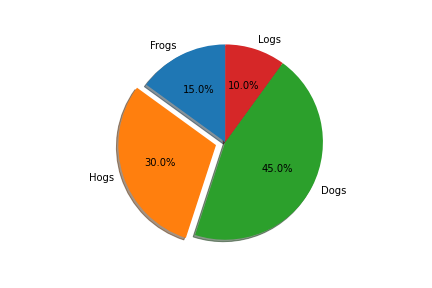

- Space inefficient

.cite[https://matplotlib.org/3.1.1/gallery/pie_and_polar_charts/pie_features.html]
]

.right-column50[
### Stacked bar chart

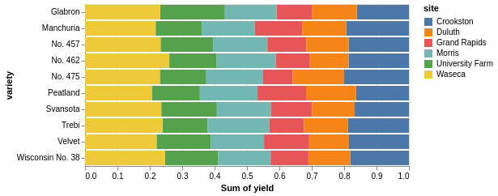

- Contributions easier to compare in side-by-side bars

.cite[https://altair-viz.github.io/gallery/normalized_stacked_bar_chart.html]
]

---

## Proportions (2/2)

.left-column50[
### Stacked areas/densities

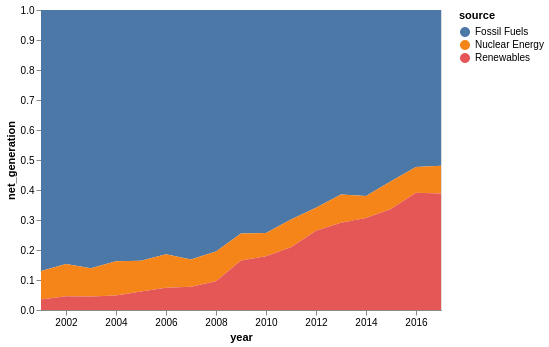

.cite[https://altair-viz.github.io/gallery/normalized_stacked_area_chart.html]
]

.right-column50[
### Treemap

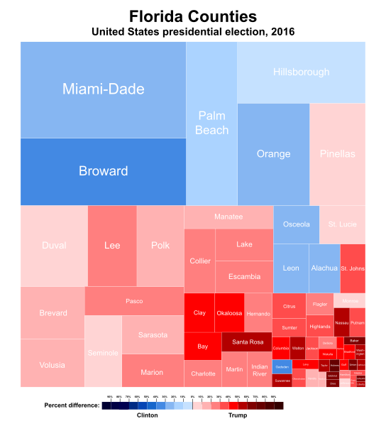

.cite[CC-BY-SA Ali Zifan https://en.wikipedia.org/wiki/Treemapping]
]

---

## Geospatial data (1/2): projections

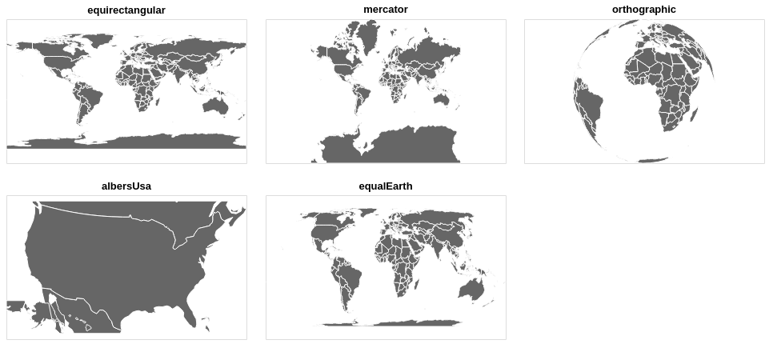

- Projection from 3D onto 2D introduces distortion
- Projections can preserve either angles or areas but not both

.cite[https://altair-viz.github.io/gallery/world_projections.html]

---

## Geospatial data (2/2): Choropleth maps

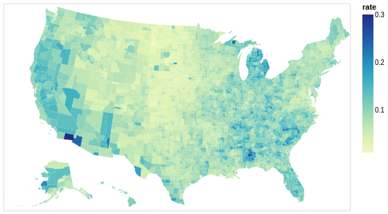

- Work best when coloring represents a density
- Can be problematic when it represents a quantity which is not a density

.cite[https://altair-viz.github.io/gallery/choropleth.html]

---

## Trends and uncertainty (1/4)

.left-column50[
### Smoothing models

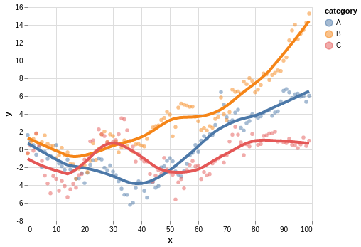

.cite[https://altair-viz.github.io/gallery/scatter_with_loess.html]
]

.right-column50[
- Averaging, polynomial fits, splines, LOESS (locally estimated scatterplot smoothing), ...
- Usually better to fit a line to transformed data than to fit a nonlinear
  curve to untransformed data
]

---

## Trends and uncertainty (2/4)

### Confidence bands

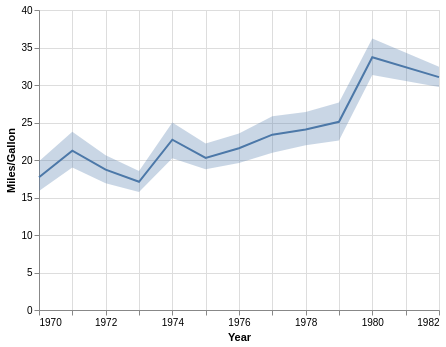

.cite[https://altair-viz.github.io/gallery/line_with_ci.html]

---

## Trends and uncertainty (3/4)

.left-column50[
### Boxplots

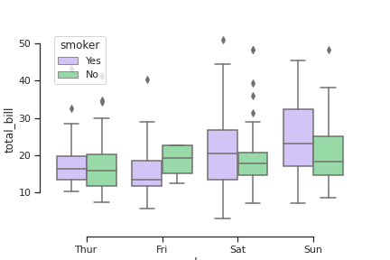

.cite[https://seaborn.pydata.org/examples/grouped_boxplot.html]
]

.right-column50[
### Error bars

.cite[https://seaborn.pydata.org/examples/pointplot_anova.html]
]

---

## Trends and uncertainty (4/4)

- Error bars can extend horizontally or vertically or both (2D error bars)
- Graded error bars and confidence strips are also used

.left-column50[
### There is no commonly accepted standard for error bars

- Always indicate what these mean: standard deviation? standard error of the
  mean? 95% confidence interval? 95% credible interval?
]

.right-column50[
### We remember this problem

- Box plots invented when figures were still drawn by hand

.cite[[J. Matejka, G. Fitzmaurice, "Same Stats, Different Graphs: Generating Datasets with Varied Appearance and Identical Statistics through Simulated Annealing"](https://www.autodeskresearch.com/publications/samestats)]
]

---

class: light-background, center, middle

 
 
 
 
 
 
# Data visualization

### Radovan Bast, UiT The Arctic University of Norway
