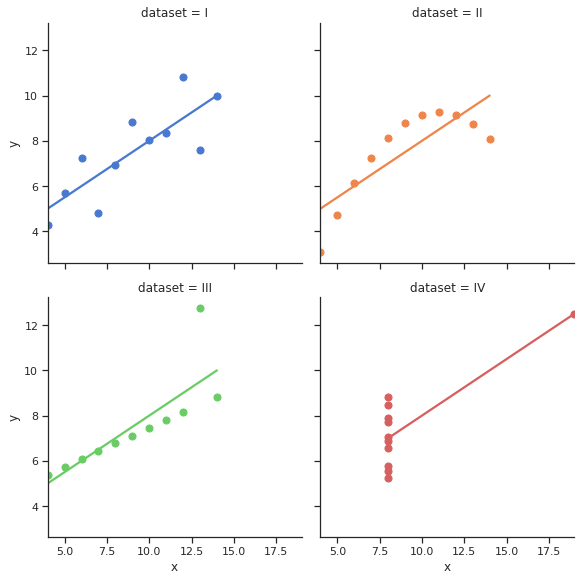

class: dark-background

# Data visualization

## Introduction and motivation

### Radovan Bast
### UiT The Arctic University of Norway

---

<!-- intro slides: 5 min -->

## Goals for this course

<!-- set expectations for this course -->

### Our focus

- Data visualization for .emph[academic publications and presentations]
- .emph[Practical] recommendations
- .emph[Reproducibility]
- Know which tools exist -> .emph[good starting points]

### What I will not focus on

- Programming languages and tools
  > .remark[But I will point to examples to get you on a good track]
- Data visualization for the general public
  > .remark[Very important but they often have different requirements]

---

## Resources

### Books

- ["Fundamentals of Data Visualization", C. O. Wilke](https://clauswilke.com/dataviz/)
  > .remark[Excellent book which does not focus on R or Python but on the fundamentals]
- ["Data Visualization: A practical introduction", K. Healy](https://socviz.co/)
  > .remark[Good if you want to learn R at the same time]
- ["Data Visualisation: A Handbook for Data Driven Design", A. Kirk](https://www.visualisingdata.com/book/)
  > .remark[Great book but a bit too general for me]

> .remark[There are many more ...]

---

## More resources

### Papers

- [N. P. Rougier, M. Droettboom, P. E. Bourne, "Ten Simple Rules for Better Figures", PLoS Comput Biol 10(9): e1003833 (2014)](https://doi.org/10.1371/journal.pcbi.1003833)

### Lessons/talks

- https://swcarpentry.github.io/visualization-novice/
- https://www.ub.uio.no/english/courses-events/events/all-libraries/2020/research-bazaar/visualisation.html
- https://ajstewartlang.github.io/SIPS_2019/SIPS_presentation.html

### Twitter

- https://twitter.com/hashtag/TidyTuesday

---

.quote["One thing I have learned over the years is that automation is your
friend. I think figures should be autogenerated as part of the data analysis
pipeline (which should also be automated), and they should come out of the
pipeline ready to be sent to the printer, no manual post-processing needed."]

.cite[["Fundamentals of Data Visualization", C. O. Wilke](https://clauswilke.com/dataviz/)]

 

.cite[https://twitter.com/kara_woo/status/1134878080567091200]

---

## 2 take-home messages

### Avoid tools that cannot be automated/scripted

- It may cause you the last minute trouble.
- Stay away from tools where plots can only be modified manually by pointing
  and clicking.

### Optimize for comprehension and accessibility

- So that we don't have to study the plot for 20 minutes with eyes hurting to
  get the message.
- Font size, colors, suitable representation, good title and caption.

---

class: center, middle, inverse

# Why visualizing data?

<!-- 5 min -->

---

## Anscombe's quartet

.left-column60[

]

.right-column40[
All four plots have the .emph[same] mean of x and y, sample variance of *x* and
*y*, correlation between *x* and *y*, linear regression line, and *R^2* coefficient.

.cite[https://en.wikipedia.org/wiki/Anscombe%27s_quartet]

.cite[https://seaborn.pydata.org/examples/anscombes_quartet.html]
]

---

## Same Stats, Different Graphs

.cite[[A. Cairo, "Datasaurus: Never trust summary statistics alone; always visualize your data"](http://www.thefunctionalart.com/2016/08/download-datasaurus-never-trust-summary.html)]

.cite[[J. Matejka, G. Fitzmaurice, "Same Stats, Different Graphs: Generating Datasets with Varied Appearance and Identical Statistics through Simulated Annealing"](https://www.autodeskresearch.com/publications/samestats)]

---

## Why visualizing data?

### More insight into data: easier to see patterns and problems

.quote["... make both calculations and graphs. Both sorts of output should be
studied; each will contribute to understanding."]
.cite[F. J. Anscombe, 1973]

### Communicating insight

- Presentations/papers: facilitate understanding
- Communication with the public

> .remark[reflect on how important and powerful data visualization is in particular in 2020: COVID-19, politics, climate change, ...]

### Because others do it or tell us to

- And we often copy the style and culture

---

## Overview

<!-- mention which sections will be there and how long each -->

### - Why visualizing data? (5 min)
### - Figure design, design process, and fundamentals (10 min)
### - Taxonomy of visualizations (10 min)
### - Choosing the right tools (5 min)
### - Reproducible and reusable plots (10 min)
### - Data formats (10 min)
### - Figures and tables in reports and publications (5 min)

---

class: light-background, center, middle

 
 
 
 
 
 
# Data visualization

### Radovan Bast, UiT The Arctic University of Norway
