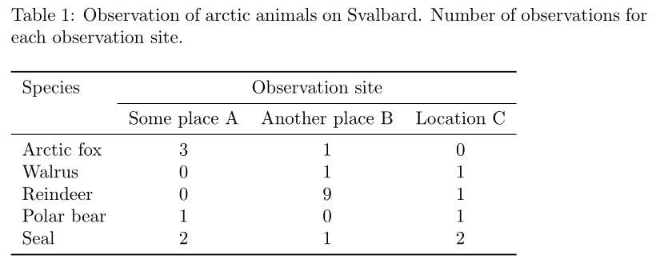
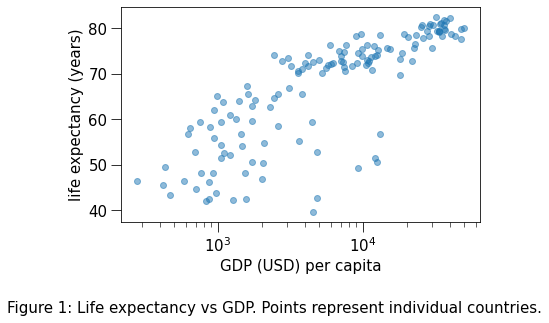
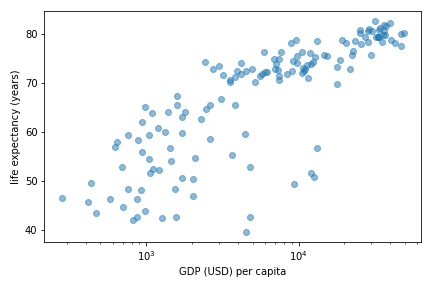

class: dark-background

# Data visualization

## Figures and tables in reports and publications

### Radovan Bast
### UiT The Arctic University of Norway

---

## Tables in publications

- Each table has a .emph[number] and a .emph[caption] that can be cross-referenced
- It is customary to place the caption .emph[above the table]
- "Tidy data" is for storing/sharing data, not for publication tables
- Do not use vertical lines
- Do not use horizontal lines between data rows
- Text: left-aligned, numbers: right-aligned, single characters: centered
- Header fields: aligned with their data

---

## Figure titles and captions

- Each figure has a .emph[number] and a .emph[caption] that can be cross-referenced
- Title is the first element of the caption
- Axes and legends need titles as well

---

## Preparing figures for print

.left-column50[

- In .emph[presentation slides] you have the full screen
]

.right-column50[

- In .emph[publications] you have often only one column
- Increase font size and ticks
- Print the figure using the approximate size it will appear in - is it still readable?
]

---

## Copyright considerations

### The problem

- When you publish a manuscript, the copyright (including figures) is typically
  transferred to the publisher.

- Then if you want to use the figures that you created later, in principle you
  need to ask the publisher.

### This is how you can keep the copyright of your figures

- Upload them to [figshare](https://figshare.com/) or [Zenodo](https://zenodo.org/).

- License them under a [Creative Commons](https://creativecommons.org/) license.

- Use these figures in your manuscript.

- You can still use them outside (in your PhD thesis) since they are now licensed CC.

---

class: light-background, center, middle

 
 
 
 
 
 
# Data visualization

### Radovan Bast, UiT The Arctic University of Norway
