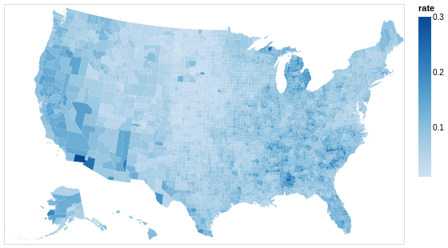
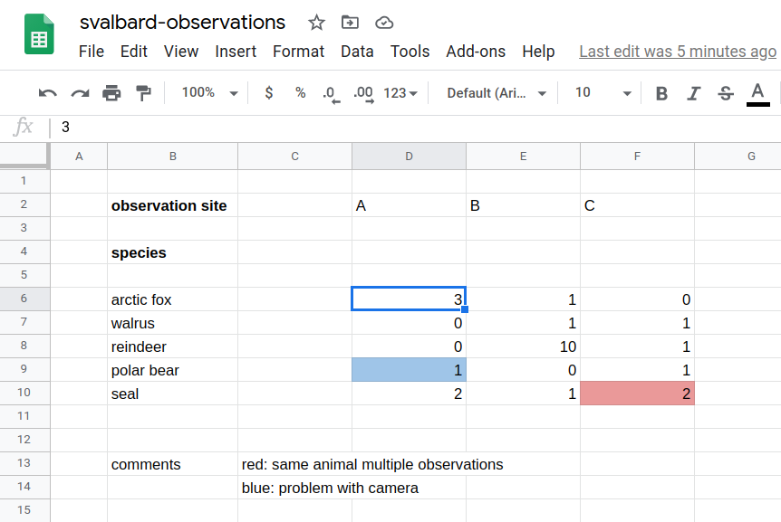

class: center, middle

# Data visualization

Part of X

## Author, Twitter

Link to slides: ...

---

<!-- intro slides: 5 min -->

## Goals for this course

<!-- set expectations for this course -->

### Our focus

- Data visualization for .emph[academic publications and presentations]
- .emph[Practical] recommendations
- .emph[Reproducibility]
- Know which tools exist -> .emph[good starting points]


### What I will not focus on

- Programming languages and tools
  > .remark[But I will point to examples to get you on a good track]
- Data visualization for the general public
  > .remark[Very important but they often have different requirements]

---

## Overview

<!-- mention which sections will be there and how long each -->

### - Why visualizing data? (5 min)
### - Figure design, design process, and fundamentals (10 min)
### - Taxonomy of visualizations (10 min)
### - Choosing the right tools (5 min)
### - Reproducible and reusable plots (10 min)
### - Data formats (10 min)
### - Figures and tables in reports and publications (5 min)

---

## Resources

### Books

- ["Fundamentals of Data Visualization", C. O. Wilke](https://clauswilke.com/dataviz/)
  > .remark[Excellent book which does not focus on R or Python but on the fundamentals]
- ["Data Visualization: A practical introduction", K. Healy](https://socviz.co/)
  > .remark[Good if you want to learn R at the same time]
- ["Data Visualisation: A Handbook for Data Driven Design", A. Kirk](https://www.visualisingdata.com/book/)
  > .remark[Great book but a bit too general for me]

> .remark[There are many more ...]

---

## More resources

### Papers

- [N. P. Rougier, M. Droettboom, P. E. Bourne, "Ten Simple Rules for Better Figures", PLoS Comput Biol 10(9): e1003833 (2014)](https://doi.org/10.1371/journal.pcbi.1003833)


### Lessons/talks

- https://swcarpentry.github.io/visualization-novice/
- https://www.ub.uio.no/english/courses-events/events/all-libraries/2020/research-bazaar/visualisation.html
- https://ajstewartlang.github.io/SIPS_2019/SIPS_presentation.html


### Twitter

- https://twitter.com/hashtag/TidyTuesday

---

.quote["One thing I have learned over the years is that automation is your
friend. I think figures should be autogenerated as part of the data analysis
pipeline (which should also be automated), and they should come out of the
pipeline ready to be sent to the printer, no manual post-processing needed."]

.cite[["Fundamentals of Data Visualization", C. O. Wilke](https://clauswilke.com/dataviz/)]

<br>


.cite[https://twitter.com/kara_woo/status/1134878080567091200]

---

## 2 take-home messages

### Avoid tools that cannot be automated/scripted

- It may cause you the last minute trouble.
- Stay away from tools where plots can only be modified manually by pointing
  and clicking.


### Optimize for comprehension and accessibility

- So that we don't have to study the plot for 20 minutes with eyes hurting to
  get the message.
- Font size, colors, suitable representation, good title and caption.

---

class: center, middle, inverse

# Why visualizing data?

<!-- 5 min -->

---

## Anscombe's quartet

.left-column60[

]

.right-column40[
All four plots have the .emph[same] mean of x and y, sample variance of *x* and
*y*, correlation between *x* and *y*, linear regression line, and *R^2* coefficient.

.cite[https://en.wikipedia.org/wiki/Anscombe%27s_quartet]

.cite[https://seaborn.pydata.org/examples/anscombes_quartet.html]
]

---

## Same Stats, Different Graphs


.cite[[A. Cairo, "Datasaurus: Never trust summary statistics alone; always visualize your data"](http://www.thefunctionalart.com/2016/08/download-datasaurus-never-trust-summary.html)]

.cite[[J. Matejka, G. Fitzmaurice, "Same Stats, Different Graphs: Generating Datasets with Varied Appearance and Identical Statistics through Simulated Annealing"](https://www.autodeskresearch.com/publications/samestats)]

---

## Why visualizing data?


### More insight into data: easier to see patterns and problems

.quote["... make both calculations and graphs. Both sorts of output should be
studied; each will contribute to understanding."]
.cite[F. J. Anscombe, 1973]


### Communicating insight

- Presentations/papers: facilitate understanding
- Communication with the public

> .remark[reflect on how important and powerful data visualization is in particular in 2020: COVID-19, politics, climate change, ...]


### Because others do it or tell us to

- And we often copy the style and culture

---

class: center, middle, inverse

# Figure design, design process, and fundamentals

<!-- 10 min -->

---

- Design approach
- Coordinates
- Proportional ink
- Channels

---

## Colors

### Great resources

- https://clauswilke.com/dataviz/color-pitfalls.html
- https://blog.datawrapper.de/beautifulcolors/
- [Okabe, M., and K. Ito. 2008. "Color Universal Design (CUD): How to Make Figures and Presentations That Are Friendly to Colorblind People."](https://jfly.uni-koeln.de/color/)
- https://seaborn.pydata.org/tutorial/color_palettes.html
- https://colorbrewer2.org/

---

## Colors

### Fundamental use cases

- Distinguish groups of data
- Represent data values
- Highlight

.cite[["Fundamentals of Data Visualization", C. O. Wilke](https://clauswilke.com/dataviz/)]


### This is how most of us start but this is problematic:

.quote["We need five colors for the plot: black ... red ... green ... blue ... ... ... orange?"]

---

## Colors

### Consider color vision deficiencies (CVD)

.left-column50[

]

.right-column50[
- 4% of the population is affected
- View your color figures under CVD simulations
- Use color scales designed to be CVD-friendly
]

---

## Color scales: 3 types

- .emph[Discrete/qualitative] color scales: designed to distinguish


.cite[[Okabe, M., and K. Ito. 2008. "Color Universal Design (CUD): How to Make Figures and Presentations That Are Friendly to Colorblind People."](https://jfly.uni-koeln.de/color/)]

- .emph[Sequential/continuous] color scales: represent data values


- .emph[Diverging] color scales: visualize deviation of data values relative to a neutral midpoint
.cite[ColorBrewer pink to yellow-green]


---

## Discrete/qualitative color scales: designed to distinguish

.left-column50[


- Great for scatter-plots.

- What if you need more than 8 colors? Use direct labeling instead.

.cite[[Okabe, M., and K. Ito. 2008](https://jfly.uni-koeln.de/color/)]
]

.right-column50[


.cite[<https://seaborn.pydata.org/examples/multiple_regression.html>]
]

---

## Sequential/continuous color scales: represent data values

.left-column50[


- Great for choropleth plots (here plotting unemployment rate).

- Color vision deficiencies less of a concern for this type.
]

.right-column50[


.cite[<https://altair-viz.github.io/gallery/choropleth.html>]
]

---

## Diverging color scales: visualize deviation of data values relative to a neutral midpoint

.left-column50[


- Great for heatmaps.

.cite[ColorBrewer pink to yellow-green]
]

.right-column50[


.cite[<https://seaborn.pydata.org/examples/many_pairwise_correlations.html>]
]

---

- Sketch, try, refine later
- Other pitfalls

---

class: center, middle, inverse

# Taxonomy of visualizations

<!-- 10 min -->

---

## Taxonomy of visualizations

We will show .emph[typical examples] and discuss .emph[main pitfalls] for each:

- x-y relationships
- Amounts
- Distributions
- Proportions
- Time series
- Trends
- Geospatial data
- Uncertainty

.cite[Categorization following https://clauswilke.com/dataviz/directory-of-visualizations.html]

---

## Where to find good overviews

These can offer other categorizations:

- https://clauswilke.com/dataviz/directory-of-visualizations.html
- https://datavizcatalogue.com/search.html
- https://depictdatastudio.com/charts/
- https://github.com/ft-interactive/chart-doctor/tree/master/visual-vocabulary
- https://extremepresentation.typepad.com/.shared/image.html?/photos/uncategorized/choosing_a_good_chart.jpg

---

<!-- https://www.autodeskresearch.com/publications/samestats fig 8 -->

---

class: center, middle, inverse

# Choosing the right tools

<!-- 5 min -->

---

## Choosing the right tools: scriptable

### There is not the one perfect language and not the one perfect library for everything

- You will have to choose what fits best you and your group
- We will show examples using .emph[Python, R, and JavaScript]

### No manual post-processing

- This will bite you when you need to regenerate
  50 figures one day before submission deadline or regenerate a set of figures
  after the person who created them left the group.
- Use software that can be scripted: (batch processing and reproducibility; more about that in next section)

---

## Choosing the right tools: free

### Use free software and free tools

- Even if the university pays for a license, what happens after you leave university
  or after they stop paying? How can other groups build on your work?
- .emph[Python and R are free], and popular for "notebook"-based pipelines, but also a number
  .emph[JavaScript frameworks] exist, especially for maps.
- Plain text files and standard formats instead of proprietary formats.

### For any academic discipline it will be a good investment to learn a bit of Python or R if you want to do data visualization

---

- Within Python, many libraries exist:
  [Matplotlib](https://matplotlib.org/),
  [Seaborn](https://seaborn.pydata.org/),
  [Altair](https://altair-viz.github.io/),
  [Plotly](https://plotly.com/python/),
  [Bokeh](https://bokeh.org/),
  [ggplot](https://yhat.github.io/ggpy/),
  [PyNGL](https://www.pyngl.ucar.edu/),
  and many others.
- Two main families of libraries: procedural (e.g. Matplotlib) and declarative
  (using grammar of graphics).

---

class: center, middle, inverse

# Reproducible and reusable plots

<!-- 10 min -->

---

## Reproducibility and FAIR principles

<!-- turingway image in here -->

---

- Where/how to store input data, scripts, and results
- Documenting the tools and environment used
- Demo with links to working recipes:
  - R/ggplot2 on R Studio/R Markdown
  - Python/matplotlib on Jupyter
  - Interactive plots: R shiny, JavaScript/D3.js
- Demo with links to working recipes:
  - Binder
  - Zenodo

<!-- Cheatsheets: -->
<!-- - https://github.com/matplotlib/cheatsheets -->

<!-- - https://rfortherestofus.com/2019/11/how-to-make-beautiful-tables-in-r/ -->

<!-- - https://rstudio.github.io/shiny/tutorial/ -->
<!-- - https://shiny.oxshef.io/tutorials.html -->
<!-- - https://aaltoscicomp.github.io/python-for-scicomp/data-visualization/ -->

<!-- image formats -->

---

class: center, middle, inverse

# Data formats

<!-- 10 min -->

---

## What is the problem with storing data like this?



<!-- this is a phantasy dataset, apologies to biology students/researchers - this is not my domain -->

--

- .emph[Format]: Limited interoperability with other programs
- .emph[Error prone] (see e.g. [this famous example](https://www.washingtonpost.com/news/wonk/wp/2013/04/16/is-the-best-evidence-for-austerity-based-on-an-excel-spreadsheet-error/))
- Difficult to parse ("understand") by scripts: .emph[difficult to automate]
- Not in *tidy format* (more about this later): .emph[difficult to extend/modify]

---

## "Messy" data structure

.left-column50[


]

.right-column50[
For the moment let us not focus on the tool, but the .emph[data structure]

How can these 3 examples be problematic for .emph[automated data visualization]?

- In the compact structure we need to divide at the comma
- If we add more species or more observation sites, we need to adapt the visualization pipeline
]

---

## "Tidy data"

.left-column50[

]

.right-column50[
- Columns are variables
- Rows are observations/measurements
- "Long form"
- Order does not matter
- .emph[Easy to extend] with more species and more sites
  without modifying the scripts
- .emph[Structure for storing data] - this does not mean that this is ideal
  for tables in presentations or publications

.cite[[H. Wickham, "Tidy Data"](http://vita.had.co.nz/papers/tidy-data.pdf)]
]

---

## Standard data formats

.left-column50[
### Comma-saparated values (CSV)

```csv
Species,Observation site,Number of sightings
arctic fox,A,3
arctic fox,B,1
walrus,B,1
walrus,C,1
reindeer,B,10
reindeer,C,1
polar bear,A,1
polar bear,C,1
seal,A,2
seal,B,1
seal,C,2
```

- CSV is often a good choice
- Most visualization tools can read CSV data
]

.right-column50[
### There are many more formats

- [JSON](https://en.wikipedia.org/wiki/JSON)
- [GeoJSON](https://geojson.org/)
- [NPY (NumPy arrays)](https://numpy.org/doc/stable/reference/generated/numpy.lib.format.html)
- [HDF5](https://en.wikipedia.org/wiki/Hierarchical_Data_Format)
- [SQL](https://en.wikipedia.org/wiki/SQL)
- Many domain-specific formats (such as [NetCDF](https://www.unidata.ucar.edu/software/netcdf/))
- .emph[Use standard formats, don't invent your own]
]

---

## Data cleaning

- Often we want to visualize data sets with inconsistent or missing entries:

```csv
Date,Organization,Number of participants
2020-09-27,UiT,20
Oct 10 2020,UiT Norges arktiske universitet,15
"Nov. 11, 2020",UiT The Arctic University of Norway,40
2020-12-12,UiT The Arctic University of Norway,-
```

Data cleaning is a bit outside the scope of this course but still good to know:
- There are tools to clean and merge inconsistent data sets
  (e.g. [OpenRefine](https://openrefine.org/))
- This does not have to be done manually

---

## Folder organization

.left-column50[
This is only a suggestion:
```
my-project/
├── README.md
├── data/
│   ├── README.md
│   ├── LICENSE
│   ├── my-data.csv
│   └── another-data.csv
├── manuscript/
│   └── paper.tex
└── figures/
    ├── LICENSE
    ├── my-notebook.ipynb
    └── another-notebook.Rmd
```
]

.right-column50[
- There is not the one right way
- Organize them to be understandable and reproducible
  by others and your .emph[future you]
- .emph[Lottery factor]: If you win the lottery and leave academic research today,
  make sure your research group can still find all related files and understand them
- Add .emph[license files]: make data and script reusable by others
]

---

## Where to store it

- Store visualization script/notebook and data in a repository under .emph[version control]
  (e.g. on [GitHub](https://github.com/))
- .emph[Stora data close to the visualization pipeline] (same repository, even if it requires extra storage)
- Archive with a persistent identifier: get a .emph[digital object identifier (DOI)] on services like
  [Zenodo](https://zenodo.org/) or [Dataverse](https://dataverse.no/)


### How about too big data?

- Reference the DOI of the data
- Consider providing a smaller example data set needed to reproduce plots


### How about sensitive data?

- There are storage options for sensitive data (e.g. patient data) but this is outside the scope
- Consider providing a "mock" example data set

---

class: center, middle, inverse

# Figures and tables in reports and publications

<!-- 5 min -->

---

- Titles
- Captions
- Cross-referencing
- Preparing figures for print
- Copyright considerations
